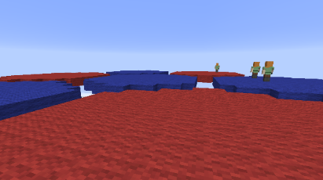
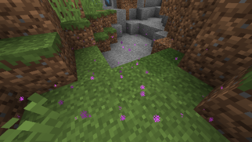
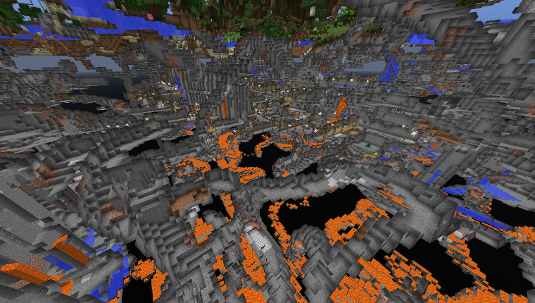
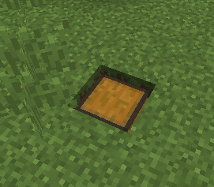
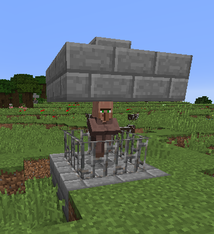
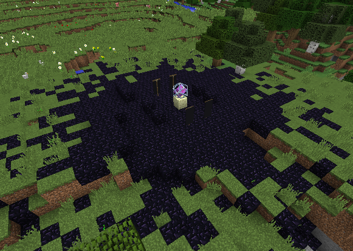
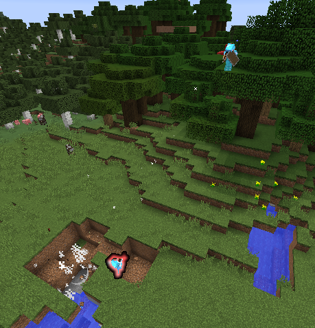

# TC UHC 说明

游戏版本：1.12-pre7

源码：https://github.com/Gamepiaynmo/TC-UHC

gp 的源说明文档：https://shimo.im/docs/6oyfrU2uK6YWSTxD

## 游戏流程

下面流程以默认配置为例

1. 进入服务器后，出生在 TC logo 的平台上。游戏准备时，每人手上会出现一本书，打开可选择加入相应队伍。若为随机分组，则书中只有黑白颜色，黑色表示参战，白色表示观战。若为手动分组，则书中会出现可选队伍颜色。在手动分组时若选择黑色，则表示在其他人选择队伍完毕的基础上随机加入队伍。随机算法会优先选择人数少的队伍以保证人数平衡

	

2. 游戏开始一段时间后，边界将开始**第一阶段收缩**，到直径 200 时停止收缩

3. 开始缩圈时，屏幕右侧将显示地狱倒计时与矿洞倒计时。地狱倒计时为 0 时地狱将关闭，未在主世界的玩家将受到每秒 1 点持续伤害

4. 洞穴倒计时为 0 时，**世界将锁定为白天和晴天**，边界将开始**第二阶段收缩**，到直径 50 时停止，与此同时边界中心将开始移动，所有玩家间断地获得高亮效果。边界 Y 轴方向开始收缩，Y 值坐标大于或小于一定值的玩家将受到每秒 1 点持续伤害。界面右侧会显示当前 Y 轴收缩位置与当前边界中心位置。接近 Y 轴边界时将有粒子效果提示：

	

## 游戏模式

1. 组队模式：此模式下队伍人数不平均时将调整队员血量作为平衡，且当队友阵亡时，所有存活队员将获得15s 的抗性提升、速度和急迫，以及一定量的生命回复，回复量根据队伍人数自动平衡

2. 国王模式：基于组队模式，不过每个队伍中将会有随机一个国王。

	国王将自动戴上与其队伍颜色相对应颜色的皮革帽子，带有保护 6、绑定诅咒、消失诅咒的附魔，无法破坏。在己方国王附近的队友可获得短暂的速度 1 效果

	**当国王死亡时，该国王的所有成员也一并死亡**

3. BOSS模式：此模式即一名玩家挑战其余所有玩家，其血量将等于其余玩家的总血量之和，会以BOSS血条形式在屏幕上方显示。

4. 单人模式：此模式下即每名玩家组成自己的队伍

5. 幽灵模式：基于单人模式，所有人拥有无限时长的无粒子效果的隐身药水效果，游戏开始时所有玩家将会获得一瓶 10s 的喷溅发光药水。建议与较小的地图边界与较短的游戏时间配合使用

玩家在阵亡后，若其队伍仍有存活队员，则将固定以观察者模式附身在队友身上。可以通过观察者界面来切换附身的队友。

## 世界生成

如无特殊说明，地形生成同原版 1.12

### 地形

海洋群系被移除

### 矿物 & 洞穴

洞穴密度被大幅度提升

矿物生成有所调整，珍贵矿物（铁、金、钻石、青金石、石英）**将暴露在空气中生成，在石头中不会生成**。金矿石仅在 y<20 生成

挖掘石英时将不再掉落经验。挖掘萤石仅掉落 1 个萤石粉，挖掘青金石仅掉落 2 个

### 宝箱

主世界地表随机生成宝箱，物品如下：

- 普通物品：木棍、骨头、线、铁锭、金锭、紫颂果、皮革、经验瓶
- 稀有物品：钻石剑、钻石镐、钻石、金苹果、1 级附魔书
	- 附魔书附魔：力量、锋利、耐久、效率、火焰附加、保护、弹射物保护

宝箱有一定概率（默认 10%）为空箱子

箱子生成几率分布为平原地形 0.06，森林地形 0.12，雪地地形 0.2，沼泽地形 0.1

### 奸商

主世界地表随机生成奸商，售卖钻石装备、金苹果等物品，收购各种矿物及末影珍珠、恶魂之泪等稀有怪物掉落物，交易货币为石英

奸商不受到任何伤害，无视重力，无法推动

**固定交易**

奸商必定会出以下交易

| 输入1    | 输入2      | 输出       |
| -------- | ---------- | ---------- |
| 1 苹果   | 18~30 石英 | 1 金苹果   |
| 1 铁胸甲 | 36~48 石英 | 1 钻石胸甲 |
| 1 铁护腿 | 30~42 石英 | 1 钻石护腿 |
| 1 铁鞋子 | 18~24 石英 | 1 钻石鞋子 |
| 1 铁帽子 | 22~30 石英 | 1 钻石帽子 |

其中的盔甲交易仅接受满耐久盔甲

**随机交易**

奸商会带有 3~5 个如下的随机交易

| 输入1      | 输入2      | 输出       |
| ---------- | ---------- | ---------- |
| 1 石英     | 2~4 经验瓶 | 1 金苹果   |
| 1 烈焰粉   | 2~4 石英   | 1~2 地狱疣 |
| 3~6 煤     |            | 1 石英     |
| 3~6 红石   |            | 1 石英     |
| 1~2 铁锭   |            | 1 石英     |
| 1 金锭     |            | 1~2 石英   |
| 1 末影珍珠 |            | 10~20 石英 |
| 1 绿宝石   |            | 10~20 石英 |
| 1 钻石     |            | 2~4 石英   |

### 末影祭坛

随机生成末影水晶的黑曜石祭坛，末影水晶会选择 32 距离内最近的玩家为攻击目标，在目标可见时造成每秒 1 点伤害。末影水晶不会攻击方块后的玩家

黑曜石平台下埋有金块。祭坛将在每个坐标象限中生成 1 个，XZ 坐标均位于初始边界大小一半以内

### 地狱

地狱的（0，0）位置将固定生成一个堡垒。地狱中仅有这一个地狱堡垒

## 物品、方块、实体

### 苹果 & 金苹果

为防止战斗时没有时间吃金苹果，将啃金苹果（以及附魔金苹果）的时间减为原来的 1/3，请随时注意食用方式，防止浪费

除了 8 金 + 1 苹果合成普通金苹果外，还可以使用 2、4、6个金锭 +1 个苹果合成劣质金苹果，此方法合成的金苹果回复血量与伤害吸收分别为 1、2、3点。注意不同回复量的金苹果无法堆叠。宝箱中的金苹果普通金苹果。

所有树叶都会掉落苹果。苹果掉率被提升为（0.5% -> 1.25%）

### 爆炸箭

原版的光灵箭在**蓄满力后**击中目标将附带爆炸效果。爆炸伤害同恶魂火球，但是可小范围破坏爆炸抗性不高于石头的方块

### 刷怪

- 取消 128m 外怪物强制移除的机制
- 提升怪物随机消失的概率
- 怪物可在弱加载区块消失

### 生物

- 被驯服的狗的项圈会被染色为主人的队伍颜色

- 杀死女巫时，必定掉落其正在饮用的药水

### 其他

- 所有种类装备均可在物品栏中修复，放入装备和对应修复材料即可，无需制作铁砧

- 每个人阵亡时都会掉落其节操，对应为锋利I附魔的物品。想要私人节操请在群里定制
- 紫颂果不会将玩家传送至边界外

## 其他改动

- 游戏中造成受到伤害时，会在聊天栏提示受到伤害的总量和来源
- 游戏结束时，会输出本剧游戏的多项排行榜
- 在死亡后，可以使用命令 `/uhc deathpos` 查看自己的死亡地点
- 上一次游戏获胜的玩家将获得黄盖专属狂拽酷炫屌炸天版火焰粒子效果！
- 说话内容前加p空格前缀可发公屏，例：`p sb gay`
- 若干可能导致卡顿、崩服、掉线、腐竹和技术自杀的bug
